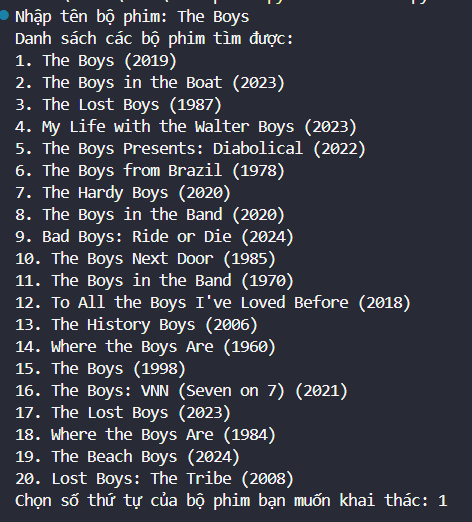
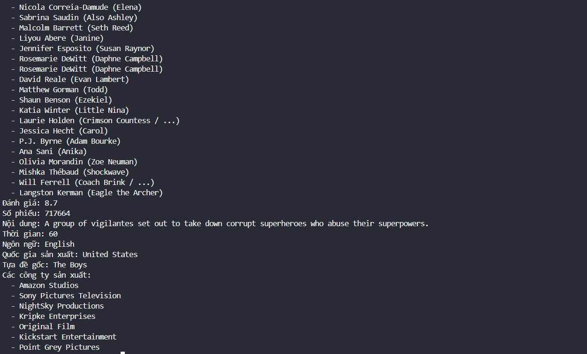

# IMDb Movie Information Fetcher - @T7C

## Giới thiệu
IMDb Movie Information Fetcher là một công cụ đơn giản được viết bằng Python để truy xuất thông tin chi tiết về bộ phim từ cơ sở dữ liệu IMDb. Sử dụng thư viện `IMDbPY`, công cụ này cho phép bạn tìm kiếm bộ phim và lấy thông tin như tiêu đề, năm phát hành, thể loại, đạo diễn, diễn viên, đánh giá, và nhiều thông tin khác.


## Cài đặt
Để sử dụng công cụ này, bạn cần cài đặt thư viện `IMDbPY`. Bạn có thể cài đặt nó bằng cách sử dụng pip:

```bash
pip install IMDbPY
```


## Sử dụng

```bash 

from imdb import IMDb
ia = IMDb()
movie_name = input("Nhập tên bộ phim: ")
movies = ia.search_movie(movie_name)

if not movies:
    print("Không tìm thấy bộ phim nào với tên này.")
else:

    print("Danh sách các bộ phim tìm được:")
    for index, movie in enumerate(movies):
        print(f"{index + 1}. {movie['title']} ({movie.get('year', 'N/A')})")
    

    choice = int(input("Chọn số thứ tự của bộ phim bạn muốn khai thác: ")) - 1
    
    if 0 <= choice < len(movies):
        movie = movies[choice]
        ia.update(movie)


        print(f"\nTiêu đề: {movie.get('title', 'N/A')}")
        print(f"Năm phát hành: {movie.get('year', 'N/A')}")
        print(f"Thể loại: {', '.join(movie.get('genres', []))}")
        print(f"Đạo diễn: {', '.join(director['name'] for director in movie.get('directors', []))}")
        

        cast = movie.get('cast', [])
        print("Diễn viên:")
        for actor in cast:
            print(f"  - {actor['name']} ({actor.currentRole})")
        

        print(f"Đánh giá: {movie.get('rating', 'N/A')}")
        print(f"Số phiếu: {movie.get('votes', 'N/A')}")
        print(f"Nội dung: {movie.get('plot', ['N/A'])[0]}")
        print(f"Thời gian: {movie.get('runtimes', ['N/A'])[0]}")
        print(f"Ngôn ngữ: {', '.join(movie.get('languages', []))}")
        print(f"Quốc gia sản xuất: {', '.join(movie.get('countries', []))}")
        print(f"Tựa đề gốc: {movie.get('original title', 'N/A')}")


        production_companies = movie.get('production companies', [])
        unique_companies = set(company.get('name', 'N/A') for company in production_companies)
        if unique_companies:
            print("Các công ty sản xuất:")
            for company in unique_companies:
                print(f"  - {company}")
        else:
            print("Các công ty sản xuất: N/A")
    else:
        print("Số thứ tự không hợp lệ.")
        
```


## Minh họa


<div>
    
    
    
</div>
